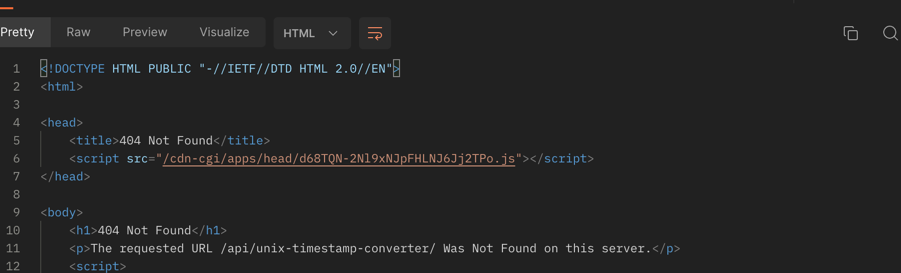

Issue #1 429 Too Many Requests, An error occurs every 10 requests in a row
Improving: Turning on a real caching of requests in a period of time with the same parameters.
The service must withstand the load

Issue #2 : Unhandled 503/404 error if user executes URI without query params
Improving: The 503 error should not be received by end-user 
404 error should be handled and have a detailed description
GET : https://helloacm.com/api/unix-timestamp-converter/
1. 
2. 

Issue #3 : Query Parameters are not documented ?cached&s=2016-01-01%202:3:22
The "cached" parameter does not work as expected. 
The "s" has incorrect name and also not documented

Issue #4 : GET endpoint /unix-timestamp-converter/ should work without the last slash symbol, for instance "/unix-timestamp-converter"

Issue #5  A parameter cached doest not work correctly namely, 
 cached with no value, 
 cached with value true
 cached with value false   
are provided the same result and the same response time

Issue #6 Query Endpoint should represent via a special response property if the value is cashed or not

Issue #7 When a user transmits a date value in the one chosen format,
in the response received from the system, he must receive the passed original value and the new converted value.

Unix Timestamp has limitations ( January 1st, 1970 at 00:00:00 UTC) - (January 19-th 2038 03:14:07 UTC)

Improvement : Supporting timezones and different formats of date namely, this format is not supporting (yet) by this API

https://docs.oracle.com/cd/E41183_01/DR/Date_Format_Types.html

API and UI behaves differently for some user cases

